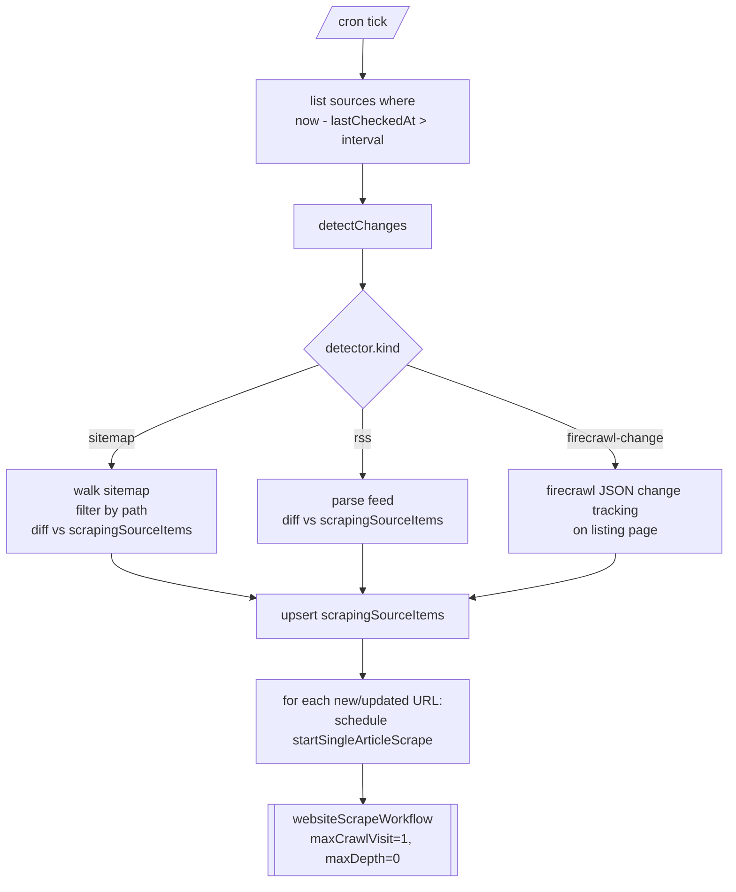

# Change Tracking for Scraping Sources

How we detect new content on listing pages (e.g. "the latest activities on site X") and feed only the changed URLs into the heavy scrape pipeline.

## Two-tier model

The pipeline splits cleanly into:

- **Tier 1 — index check** (cheap, runs on a cron). For one configured *source*, returns the set of URLs that are new or updated since last check.
- **Tier 2 — detail scrape** (expensive, runs only on Tier 1 hits). For each URL, kicks off the existing `websiteScrapeWorkflow` with `maxCrawlVisit=1, maxDepth=0`.

This split is the backbone. The Tier 1 detection mechanism is **pluggable per source** because real-world sites don't all expose the same metadata.



## Detector taxonomy

| Detector | When to use | State per item | Notes |
|---|---|---|---|
| `sitemap` | Site has a working `sitemap.xml` (or `.xml.gz`) covering the URLs you care about | `lastmod` from `<lastmod>` | Walks `<sitemapindex>` recursively. Path filter (`pathIncludes`) lets you target a sub-section like `/melbourne/kids/` inside a much larger sitemap. |
| `rss` | Site exposes an RSS/Atom feed listing the items you want | `pubDate` | Cheapest. Bounded item count (most feeds cap at ~10–50 most recent). |
| `firecrawl-change` | No feed and no usable sitemap | content hash kept by firecrawl | Uses [Firecrawl change tracking](https://docs.firecrawl.dev/features/change-tracking) in `json` mode against a schema like `{ items: [{ url, title }] }`. Most expensive (one scrape credit per check) and ties Tier 1 to firecrawl. |

## Adding a new source — checklist

When someone gives you a new URL to track, walk these checks in order. Stop at the first one that gives you a usable signal.

### 1. RSS / Atom feed

```bash
# look for a feed link in the page <head>
curl -sSL -H "User-Agent: Mozilla/5.0" "$URL" \
  | grep -iE 'rel="alternate"|application/rss|application/atom'

# common conventions to probe
curl -sSI "$ORIGIN/feed/"            # WordPress
curl -sSI "$ORIGIN/rss"
curl -sSI "$URL/feed"
curl -sSI "$URL?format=rss"          # Squarespace
```

A working feed returns 200 with `content-type: application/rss+xml` (or `application/atom+xml`) and well-formed XML with `<item>` / `<entry>` elements. **Verify it covers the items you care about** — some feeds only expose news posts and skip evergreen pages.

### 2. Sitemap

```bash
# robots.txt is the canonical pointer
curl -sSL "$ORIGIN/robots.txt" | grep -i sitemap

# common conventions to probe
curl -sSI "$ORIGIN/sitemap.xml"
curl -sSI "$ORIGIN/sitemap.xml.gz"
curl -sSI "$ORIGIN/sitemap_index.xml"
```

A working sitemap means: HTTP 200, **`content-length > 0`**, body parses as XML with `<urlset>` (or `<sitemapindex>` pointing at child sitemaps).

Critical follow-up checks:

- **Is it empty?** Some servers respond 200 with `content-length: 0` on the gzipped path (we've seen this on `whatson.melbourne.vic.gov.au`). That's not a usable sitemap.
- **Does it have `<lastmod>`?** Without it you can detect *new* URLs but not *updated* ones — usually fine for our use case but worth noting.
- **Does it cover your URLs?** Big multi-region sites (e.g. `timeout.com`) have a sitemap-index pointing at sharded sitemaps. The high-level `news_sitemap.xml` is usually too narrow (Google News spec — last 48h only). The full city sitemap is the real target. Filter URLs by path to your section.

### 3. Firecrawl change tracking (fallback)

If the first two yield nothing, configure a `firecrawl-change` detector against the listing page. Define a JSON schema describing the items you care about:

```json
{ "items": [{ "url": "string", "title": "string" }] }
```

Firecrawl returns `{ status: "new" | "same" | "changed" | "removed", json: { previous, current } }` on each scrape — diff `current.items[].url` against `previous.items[].url` to get the new ones.

### Decision tree

```mermaid
flowchart TD
    Start([new source URL]) --> RSS{RSS/Atom found?}
    RSS -- yes --> CoverageA{covers the items<br/>you care about?}
    CoverageA -- yes --> UseRss[detector: rss]
    CoverageA -- no --> Sitemap
    RSS -- no --> Sitemap{sitemap found<br/>and non-empty?}
    Sitemap -- yes --> Lastmod{has &lt;lastmod&gt;<br/>per URL?}
    Lastmod -- yes --> CoverageB{covers your URLs?<br/>(may need path filter)}
    Lastmod -- no --> CoverageB
    CoverageB -- yes --> UseSitemap[detector: sitemap<br/>with pathIncludes]
    CoverageB -- no --> Firecrawl
    Sitemap -- no --> Firecrawl[detector: firecrawl-change]
```

## Audit: the three sources we evaluated

Probed 2026-05-06.

| Source | RSS | Sitemap | Chosen detector |
|---|---|---|---|
| `mammaknowsmelbourne.com.au/the-latest` | ❌ `/feed/`, `?format=rss`, `/the-latest/feed` all error | ✅ `sitemap.xml` is a single urlset, ~80+ URLs, per-URL `<lastmod>`. Lists individual content URLs (playgrounds, dining), not the `/the-latest` aggregation — which is actually better, we don't depend on listing-page DOM | `sitemap` |
| `timeout.com/melbourne/kids` | ❌ no feed link tags | ✅ `/melbourne/sitemap.xml.gz` is an index of 14 shards × ~1000 URLs each, per-URL `<lastmod>`. `/melbourne/kids/*` paths are sprinkled across shards, ~50–100 total. The advertised `news_sitemap.xml` is too narrow (Google News spec, last 48h only). | `sitemap` with `pathIncludes: "/melbourne/kids/"` |
| `whatson.melbourne.vic.gov.au/things-to-do/family-and-kids` | ❌ no feed link tags | ❌ `/sitemap.xml.gz` returns 200 OK with `content-length: 0`; `/sitemap.xml` and `/sitemap_index.xml` return 404 | `firecrawl-change` |

## Schema

```ts
// convex/schema.ts

scrapingSources: defineTable({
  url: v.string(),                  // listing URL (display)
  name: v.optional(v.string()),
  active: v.optional(v.boolean()),
  interval: v.union(
    v.literal("daily"), v.literal("weekly"),
    v.literal("monthly"), v.literal("manual"),
  ),
  lastCheckedAt: v.optional(v.number()),
  lastChangeAt: v.optional(v.number()),
  detector: v.union(
    v.object({
      kind: v.literal("sitemap"),
      sitemapUrl: v.string(),
      pathIncludes: v.optional(v.string()),
      pathExcludes: v.optional(v.array(v.string())),
    }),
    v.object({
      kind: v.literal("rss"),
      feedUrl: v.string(),
    }),
    v.object({
      kind: v.literal("firecrawl-change"),
      listingUrl: v.string(),
      schemaJson: v.string(),
    }),
  ),
  detailScrapeOptions: v.optional(v.object(scrapeOptions)),
  createdAt: v.number(),
}).index("by_active_lastCheckedAt", ["active", "lastCheckedAt"]),

scrapingSourceItems: defineTable({
  sourceId: v.id("scrapingSources"),
  url: v.string(),
  lastmod: v.optional(v.string()),
  contentHash: v.optional(v.string()),
  firstSeenAt: v.number(),
  lastSeenAt: v.number(),
  status: v.union(
    v.literal("discovered"),
    v.literal("queued"),
    v.literal("scraped"),
    v.literal("failed"),
  ),
  detailWorkflowId: v.optional(v.string()),
})
  .index("by_source_and_url", ["sourceId", "url"])
  .index("by_source_and_status", ["sourceId", "status"]),
```

## Key entry points

- `convex/crons.ts` — hourly `scrape-source-tick`.
- `convex/changeTracking.ts` (`"use node"`) — `tick`, `detectChanges` dispatcher, and all three detectors (`detectViaSitemap`, `detectViaRss`, `detectViaFirecrawl`). Sitemap walker handles gzip + sitemap-index recursion.
- `convex/scrapingSources.ts` — public `register` / `list` / `setActive` / `runNow`; internal `get` / `listDue` / `markChecked`.
- `convex/scrapingSourceItems.ts` — internal `listBySource` / `upsertBatch` / `markQueued` / `setStatus`.
- `convex/scrapeWorkflow.ts` → `startSingleScrape` — Tier 2 entry, wraps `websiteScrapeWorkflow` with `maxCrawlVisit=1, maxDepth=0`. Accepts an optional `source: { sourceId, url }` so `handleWorkflowComplete` can flip the item's status to `scraped`/`failed`.

## Lifecycle of a source item

`discovered` (detector found it) → `queued` (Tier 2 workflow scheduled, `detailWorkflowId` set) → `scraped` / `failed` (workflow completed, written back by `handleWorkflowComplete`).

## Status of the detectors

- `sitemap` — implemented, smoke-tested against mamma.
- `rss` — implemented (RSS 2.0 + Atom), not yet exercised against a live source.
- `firecrawl-change` — implemented. Diffs Firecrawl's `changeTracking.json.items.current` against our own seen set. No per-item `lastmod`, so it only detects genuinely new URLs, not content updates to an already-seen URL.

## New dependencies

- `fast-xml-parser` — sitemap/RSS parsing. Small, no transitives.
- `@mendable/firecrawl-js` — already a dependency (used by the main scrape pipeline); reused for the `firecrawl-change` detector.
- `zlib` — built-in (Node), used for `.gz` sitemaps.
