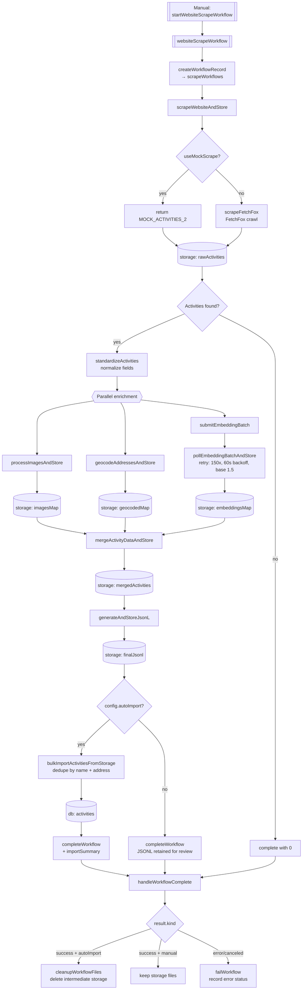

# Scraping Pipeline

End-to-end flow for the website → activities ingestion pipeline.

## Triggers

- **Manual** — `scrapeWorkflow.startWebsiteScrapeWorkflow` mutation starts the workflow with a URL + config. This is the only entry point today.

## Workflow stages

`websiteScrapeWorkflow` (`convex/scrapeWorkflow.ts`) orchestrates the steps below. Each step writes intermediate artifacts to Convex storage and records the storage IDs on the `scrapeWorkflows` row via `workflowMetadata.updateWorkflowFile`.

## Storage targets

**Database tables**
- `scrapeWorkflows` — workflow metadata: status, intermediate file IDs, timings, import summary.
- `activities` — final destination, populated only when `autoImport === true`.

**Convex storage (intermediate JSON/JSONL artifacts; deleted only on autoImport success)**
- `rawActivities` — raw scraper output
- `imagesMap` — processed image URL map
- `geocodedMap` — address → coordinates
- `embeddingsMap` — embedding vectors
- `mergedActivities` — fully enriched activities
- `finalJsonl` — export-ready JSONL

**External services**
- FetchFox (web crawler / extractor)
- Embeddings batch API
- Geocoding API
- Image processing

## Error paths

- Invalid URL → throws before scraping starts, workflow fails.
- FetchFox scrape failure → throws, workflow fails.
- No activities extracted → early exit, workflow completes with count 0.
- Embedding batch not ready → retried up to 150 times with 60s initial backoff (base 1.5).
- Duplicate activity (name + address) → skipped during import, counted in summary.
- Import failure on a row → logged, summary records failure, workflow still completes.
- Workflow failure/cancel → `handleWorkflowComplete` schedules `failWorkflow` to record the error status.
- Storage cleanup failure → warning only, does not fail the workflow.

## Key entry points

- `convex/scrapeWorkflow.ts:49` — `websiteScrapeWorkflow` definition
- `convex/scrapeWorkflow.ts:369` — `startWebsiteScrapeWorkflow` mutation
- `convex/scrapeWorkflow.ts:404` — `handleWorkflowComplete` callback
- `convex/scraping.ts:5730` — `scrapeWebsiteAndStore` (FetchFox + mock branch)
