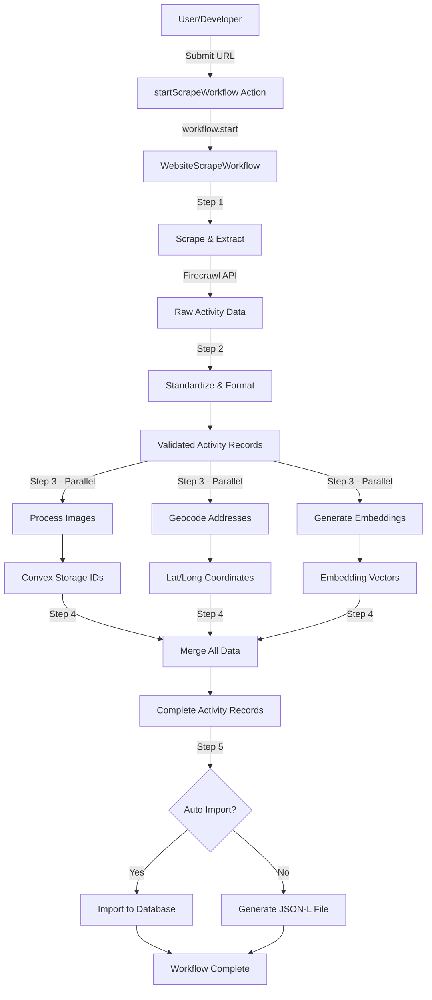

# Design: Website Scraping ETL Pipeline

## Overview

This feature implements a comprehensive web scraping and ETL pipeline using **Convex Workflows** to orchestrate a multi-stage process that transforms website content into structured activity records ready for database import. The workflow is triggered by an action, executes durable steps for scraping, processing, and enrichment, and produces a JSON-L output file that can be imported into the activities table.

### Architecture Principles

1. **Workflow-Based Orchestration**: Convex workflows provide durability, retry logic, and progress tracking for long-running operations
2. **Step-by-Step Processing**: Each pipeline stage (scraping, formatting, geocoding, embedding, merging) is a discrete workflow step
3. **Parallel Processing**: Where possible, independent operations (image downloads, geocoding, embedding generation) execute in parallel
4. **Error Resilience**: Individual failures don't crash the entire pipeline; errors are logged and the workflow continues
5. **Observability**: Each step logs progress and results for monitoring

## High-Level Architecture



## Component Architecture

### 1. Workflow Entry Point

**File**: `convex/scrapeWorkflow.ts`

```typescript
import { WorkflowManager } from "@convex-dev/workflow";
import { components } from "./_generated/api";
import { v } from "convex/values";

export const workflow = new WorkflowManager(components.workflow);

export const websiteScrapeWorkflow = workflow.define({
  args: {
    url: v.string(),
    config: v.optional(v.object({
      maxDepth: v.optional(v.number()),
      maxPages: v.optional(v.number()),
      autoImport: v.optional(v.boolean()),
      urgencyDefault: v.optional(v.union(
        v.literal("low"),
        v.literal("medium"),
        v.literal("high")
      )),
      isPublic: v.optional(v.boolean()),
    })),
  },
  handler: async (step, args) => {
    // Workflow implementation (detailed below)
  }
});

export const startScrapeWorkflow = action({
  args: {
    url: v.string(),
    config: v.optional(/* same as workflow config */),
  },
  handler: async (ctx, args) => {
    // Validate URL
    // Start workflow
    // Return workflow ID
  }
});
```

### 2. Step 1: Scraping & Extraction

**Action**: `scrapeWebsite` (internal action in `convex/scraping.ts`)

**Responsibilities**:
- Use Firecrawl API to crawl the target URL
- Discover and scrape relevant sublinks
- Extract rough activity data from each page
- Return array of raw activity objects

**Technologies**:
- **Firecrawl SDK** (to be installed: `npm install @mendable/firecrawl-js`)
- **Environment Variables**: `FIRECRAWL_API_KEY` (to be added to `convex/env.ts`)

**Data Flow**:
```typescript
Input: { url: string, maxDepth?: number, maxPages?: number }
Output: Array<{
  name: string
  description?: string
  location?: {
    name?: string
    formattedAddress?: string
    street_address?: string
    city?: string
    state_province?: string
    postal_code?: string
    country_code?: string
  }
  startDate?: string
  endDate?: string
  tags?: string[]
  imageURL?: string
}>
```

**Implementation Details**:
```typescript
// convex/scraping.ts
import Firecrawl from "@mendable/firecrawl-js";
import { action } from "./_generated/server";
import { internal } from "./_generated/api";
import { v } from "convex/values";
import { env } from "./env";

export const scrapeWebsite = action({
  args: {
    url: v.string(),
    maxDepth: v.optional(v.number()),
    maxPages: v.optional(v.number()),
  },
  handler: async (ctx, args) => {
    const firecrawl = new Firecrawl({ apiKey: env.FIRECRAWL_API_KEY });

    // Use Firecrawl crawl endpoint with schema extraction
    const crawlResult = await firecrawl.crawlUrl(args.url, {
      limit: args.maxPages || 50,
      maxDepth: args.maxDepth || 2,
      // Use schema-based extraction for structured data
      extractorOptions: {
        mode: "llm-extraction",
        extractionPrompt: `Extract activity information from this page. For each activity, extract:
          - name (required)
          - description (optional)
          - location (optional): name, formattedAddress, street_address, city, state_province, postal_code, country_code
          - startDate (optional, ISO format)
          - endDate (optional, ISO format)
          - tags (optional array)
          - imageURL (optional)
        Return an array of activities.`,
      }
    });

    // Flatten and deduplicate activities from all crawled pages
    const activities = /* process crawlResult */;

    return activities;
  }
});
```

### 3. Step 2: Standardization & Formatting

**Mutation**: `standardizeActivities` (internal mutation in `convex/formatting.ts`)

**Responsibilities**:
- Validate each activity has required fields (name)
- Apply default values: `urgency: "medium"`, `isPublic: true`
- Normalize tags (deduplicate, lowercase, trim)
- Validate date formats
- Skip invalid activities with logging

**Data Flow**:
```typescript
Input: Array<RawActivity>
Output: Array<StandardizedActivity> // With defaults applied
```

**Implementation**:
```typescript
// convex/formatting.ts
import { internalMutation } from "./_generated/server";
import { v } from "convex/values";

export const standardizeActivities = internalMutation({
  args: {
    rawActivities: v.array(v.any()),
    config: v.object({
      urgencyDefault: v.optional(v.union(
        v.literal("low"),
        v.literal("medium"),
        v.literal("high")
      )),
      isPublic: v.optional(v.boolean()),
    }),
  },
  handler: async (ctx, args) => {
    const standardized = [];

    for (const raw of args.rawActivities) {
      // Validate required fields
      if (!raw.name || typeof raw.name !== 'string') {
        console.warn("Skipping activity without name:", raw);
        continue;
      }

      // Apply defaults and normalize
      const activity = {
        name: raw.name,
        description: raw.description,
        urgency: raw.urgency || args.config.urgencyDefault || "medium",
        isPublic: raw.isPublic ?? args.config.isPublic ?? true,
        location: raw.location ? {
          name: raw.location.name || "",
          formattedAddress: raw.location.formattedAddress || "",
          street_address: raw.location.street_address,
          city: raw.location.city,
          state_province: raw.location.state_province,
          postal_code: raw.location.postal_code,
          country_code: raw.location.country_code,
        } : undefined,
        startDate: /* validate ISO date */,
        endDate: /* validate ISO date */,
        tags: raw.tags ?
          Array.from(new Set(raw.tags.map(t => t.trim().toLowerCase()))) :
          undefined,
        imageURL: raw.imageURL,
      };

      standardized.push(activity);
    }

    return standardized;
  }
});
```

### 4. Step 3: Parallel Processing (Images, Geocoding, Embeddings)

#### 4a. Image Processing

**Action**: `processImages` (internal action in `convex/imageProcessing.ts`)

**Responsibilities**:
- Download images from `imageURL` for each activity
- Upload to Convex storage
- Return map of activity index to storage ID

**Implementation**:
```typescript
// convex/imageProcessing.ts
import { action } from "./_generated/server";
import { v } from "convex/values";
import { internal } from "./_generated/api";

export const processImages = action({
  args: {
    activities: v.array(v.any()),
  },
  handler: async (ctx, args) => {
    const imageMap: Record<number, Id<"_storage">> = {};

    for (let i = 0; i < args.activities.length; i++) {
      const activity = args.activities[i];
      if (!activity.imageURL) continue;

      try {
        // Fetch image
        const response = await fetch(activity.imageURL);
        if (!response.ok) throw new Error(`HTTP ${response.status}`);

        const blob = await response.blob();

        // Upload to Convex storage
        const storageId = await ctx.storage.store(blob);
        imageMap[i] = storageId;
      } catch (error) {
        console.error(`Failed to process image for activity ${i}:`, error);
        // Continue without image
      }
    }

    return imageMap;
  }
});
```

#### 4b. Geocoding

**Action**: `geocodeAddresses` (internal action in `convex/geocoding.ts`)

**Responsibilities**:
- For each activity with location data, geocode the address
- Use Google Maps Geocoding API
- Return map of activity index to geocoded location data

**Technologies**:
- **Google Maps Geocoding API** (API key already in env as `GOOGLE_MAPS_API_KEY`)

**Implementation**:
```typescript
// convex/geocoding.ts
import { action } from "./_generated/server";
import { v } from "convex/values";

export const geocodeAddresses = action({
  args: {
    activities: v.array(v.any()),
  },
  handler: async (ctx, args) => {
    const geocodedMap: Record<number, {
      latitude: number;
      longitude: number;
      placeId: string;
      formattedAddress: string;
      street_address?: string;
      city?: string;
      state_province?: string;
      postal_code?: string;
      country_code?: string;
    }> = {};

    for (let i = 0; i < args.activities.length; i++) {
      const activity = args.activities[i];
      if (!activity.location?.formattedAddress) continue;

      try {
        const apiKey = process.env.NEXT_PUBLIC_GOOGLE_MAPS_API_KEY;
        const url = `https://maps.googleapis.com/maps/api/geocode/json?address=${encodeURIComponent(activity.location.formattedAddress)}&key=${apiKey}`;

        const response = await fetch(url);
        const data = await response.json();

        if (data.status === "OK" && data.results[0]) {
          const result = data.results[0];

          // Extract structured address components
          const components = result.address_components;
          const geocoded = {
            latitude: result.geometry.location.lat,
            longitude: result.geometry.location.lng,
            placeId: result.place_id,
            formattedAddress: result.formatted_address,
            street_address: /* extract from components */,
            city: /* extract from components */,
            state_province: /* extract from components */,
            postal_code: /* extract from components */,
            country_code: /* extract from components */,
          };

          geocodedMap[i] = geocoded;
        }
      } catch (error) {
        console.error(`Failed to geocode activity ${i}:`, error);
        // Continue without geocoding
      }
    }

    return geocodedMap;
  }
});
```

#### 4c. Embedding Generation

**Action**: `generateEmbeddings` (internal action in `convex/embeddings.ts`)

**Responsibilities**:
- Prepare embedding input text for each activity
- Submit batch embedding request to OpenAI
- Return batch ID for polling

**Action**: `retrieveBatchEmbeddings` (internal action in `convex/embeddings.ts`)

**Responsibilities**:
- Poll OpenAI Batch API for completion status
- Download and parse completed embeddings
- Return embedding vectors mapped to activity indices

**Technologies**:
- **OpenAI Batch API** (already used in existing scripts)
- Reuse embedding logic from `scripts/upload-embeddings-batch.ts`

**Workflow Integration - Transaction Guarantees**:

This implementation uses **Convex Workflows instead of scheduled functions** for the following transaction guarantees:

1. **Durability**: Workflow survives server restarts during the polling period (batch jobs can take hours)
2. **Exactly-Once Semantics**: Each poll attempt is a named workflow step, guaranteed to execute exactly once
3. **Atomic Sequence**: Batch submission → polling → retrieval is transactional - if workflow fails, entire embedding step fails atomically
4. **Built-in Retry**: Workflow `step.sleep()` provides durable pauses between polls without external state
5. **No State Management**: Polling state (attempt count, batch ID) lives in workflow execution context, not database

**Alternative Rejected**: Scheduled functions (`ctx.scheduler.runAfter`) would require:
- Manual polling state management in database
- At-most-once execution guarantees for actions (potential state loss)
- Complex recursive scheduling logic
- Risk of race conditions between poll attempts

**Implementation**:

```typescript
// convex/embeddings.ts
import { action } from "./_generated/server";
import { v } from "convex/values";
import OpenAI from "openai";
import { env } from "./env";

export const generateEmbeddings = action({
  args: {
    activities: v.array(v.any()),
  },
  handler: async (ctx, args) => {
    const openai = new OpenAI({ apiKey: env.OPENAI_API_KEY });

    // Prepare batch requests
    const batchRequests = args.activities.map((activity, i) => {
      const parts = [
        activity.name,
        activity.description || "",
        activity.location?.name || "",
        activity.location?.formattedAddress || "",
        ...(activity.tags || []),
      ];

      return {
        custom_id: `request-${i}`,
        method: "POST",
        url: "/v1/embeddings",
        body: {
          model: "text-embedding-3-small",
          input: parts.join(" "),
          encoding_format: "float",
        },
      };
    });

    // Create batch file
    const batchContent = batchRequests.map(r => JSON.stringify(r)).join("\n");
    const file = await openai.files.create({
      file: new Blob([batchContent]),
      purpose: "batch",
    });

    // Submit batch
    const batch = await openai.batches.create({
      input_file_id: file.id,
      endpoint: "/v1/embeddings",
      completion_window: "24h",
    });

    return { batchId: batch.id };
  }
});

export const retrieveBatchEmbeddings = action({
  args: {
    batchId: v.string(),
  },
  handler: async (ctx, args) => {
    const openai = new OpenAI({ apiKey: env.OPENAI_API_KEY });

    const batch = await openai.batches.retrieve(args.batchId);

    // Return status for workflow polling logic
    if (batch.status !== "completed") {
      return { status: batch.status, embeddings: null };
    }

    if (batch.status === "failed" || batch.status === "expired" || batch.status === "cancelled") {
      return { status: batch.status, embeddings: null, error: "Batch processing failed" };
    }

    // Download results
    const fileContent = await openai.files.content(batch.output_file_id!);
    const fileBuffer = Buffer.from(await fileContent.arrayBuffer());
    const lines = fileBuffer.toString().split("\n").filter(l => l.trim());

    const embeddingsMap: Record<number, number[]> = {};

    for (const line of lines) {
      const response = JSON.parse(line);
      const index = parseInt(response.custom_id.replace("request-", ""));

      // Handle potential errors in individual embedding requests
      if (response.response.status_code === 200) {
        embeddingsMap[index] = response.response.body.data[0].embedding;
      } else {
        console.error(`Embedding failed for activity ${index}:`, response.error);
      }
    }

    return { status: "completed", embeddings: embeddingsMap };
  }
});
```

### 5. Step 4: Data Merging

**Mutation**: `mergeActivityData` (internal mutation in `convex/formatting.ts`)

**Responsibilities**:
- Combine standardized activities with processed images, geocoded locations, and embeddings
- Produce final activity records conforming to schema

**Data Flow**:
```typescript
Input: {
  activities: Array<StandardizedActivity>,
  images: Record<number, Id<"_storage">>,
  geocoded: Record<number, GeocodedLocation>,
  embeddings: Record<number, number[]>,
}
Output: Array<CompleteActivity>
```

### 6. Step 5: Database Import or File Generation

**Option A - Auto Import**: `bulkImportActivities` (internal mutation)

**Responsibilities**:
- Insert activities using `createActivityDocument`
- Handle duplicates
- Return summary stats

**Option B - File Generation**: `generateJsonL` (internal mutation/action)

**Responsibilities**:
- Convert activity array to JSON-L format
- Store in Convex storage or return content
- Return file reference

## Workflow Implementation

```typescript
// convex/scrapeWorkflow.ts
export const websiteScrapeWorkflow = workflow.define({
  args: { url: v.string(), config: v.optional(/* ... */) },
  handler: async (step, args) => {
    const config = {
      maxDepth: args.config?.maxDepth || 2,
      maxPages: args.config?.maxPages || 50,
      autoImport: args.config?.autoImport || false,
      urgencyDefault: args.config?.urgencyDefault || "medium",
      isPublic: args.config?.isPublic ?? true,
    };

    // Step 1: Scrape website
    const rawActivities = await step.runAction(
      internal.scraping.scrapeWebsite,
      {
        url: args.url,
        maxDepth: config.maxDepth,
        maxPages: config.maxPages,
      },
      { name: "scrape-website" }
    );

    // Step 2: Standardize and format
    const standardizedActivities = await step.runMutation(
      internal.formatting.standardizeActivities,
      {
        rawActivities,
        config: {
          urgencyDefault: config.urgencyDefault,
          isPublic: config.isPublic,
        },
      },
      { name: "standardize-activities" }
    );

    // Step 3: Parallel processing
    const [imageMap, geocodedMap, embeddingBatch] = await Promise.all([
      step.runAction(
        internal.imageProcessing.processImages,
        { activities: standardizedActivities },
        { name: "process-images" }
      ),
      step.runAction(
        internal.geocoding.geocodeAddresses,
        { activities: standardizedActivities },
        { name: "geocode-addresses" }
      ),
      step.runAction(
        internal.embeddings.generateEmbeddings,
        { activities: standardizedActivities },
        { name: "generate-embeddings-batch" }
      ),
    ]);

    // Step 3b: Poll for embedding completion (TRANSACTIONAL GUARANTEE)
    // Using workflow sleep instead of scheduled functions ensures:
    // - Durability: Survives server restarts
    // - Exactly-once polling: Each attempt is a named workflow step
    // - Atomic failure handling: Timeout or failure handled transactionally
    let embeddingsMap = null;
    let attempts = 0;
    const maxAttempts = 120; // Max 2 hours with 1-minute intervals

    while (attempts < maxAttempts && !embeddingsMap) {
      // Durable sleep - workflow state persists across restarts
      await step.sleep("wait-for-embeddings", 60000); // 1 minute

      const result = await step.runAction(
        internal.embeddings.retrieveBatchEmbeddings,
        { batchId: embeddingBatch.batchId },
        { name: `poll-embeddings-${attempts}` } // Named step for exactly-once guarantee
      );

      if (result.status === "completed") {
        embeddingsMap = result.embeddings;
        break;
      } else if (result.status === "failed" || result.status === "expired" || result.status === "cancelled") {
        console.error(`Batch ${result.status}:`, result.error);
        break; // Exit early on terminal failure
      }

      attempts++;
    }

    if (!embeddingsMap) {
      console.error("Embedding batch timed out or failed");
      embeddingsMap = {}; // Continue without embeddings
    }

    // Step 4: Merge all data
    const completeActivities = await step.runMutation(
      internal.formatting.mergeActivityData,
      {
        activities: standardizedActivities,
        images: imageMap,
        geocoded: geocodedMap,
        embeddings: embeddingsMap,
      },
      { name: "merge-activity-data" }
    );

    // Step 5: Import or generate file
    if (config.autoImport) {
      const importSummary = await step.runMutation(
        internal.importing.bulkImportActivities,
        { activities: completeActivities },
        { name: "import-to-database" }
      );

      return {
        success: true,
        totalActivities: completeActivities.length,
        imported: importSummary.imported,
        skipped: importSummary.skipped,
        failed: importSummary.failed,
      };
    } else {
      const fileRef = await step.runAction(
        internal.importing.generateJsonL,
        { activities: completeActivities },
        { name: "generate-jsonl-file" }
      );

      return {
        success: true,
        totalActivities: completeActivities.length,
        fileRef,
      };
    }
  }
});
```

## Transaction Guarantees and Durability

### Workflow-Based Transaction Model

This implementation prioritizes **strong transaction guarantees** by using Convex Workflows over scheduled functions:

**Durability Guarantees**:
1. **State Persistence**: Workflow execution state survives server restarts and crashes
2. **Exactly-Once Execution**: Each named workflow step executes exactly once, preventing duplicate processing
3. **Atomic Failure Handling**: If the workflow fails, the entire pipeline fails atomically (no partial states)
4. **Resumable Execution**: After server restart, workflow resumes from the last completed step

**Embedding Polling - Critical Design Decision**:

The embedding generation step requires polling an external API (OpenAI Batch) that can take hours. Two approaches were considered:

| Approach | Transaction Guarantee | Complexity | State Management |
|----------|----------------------|------------|------------------|
| **Workflows (✅ Chosen)** | Exactly-once, durable | Low (built-in `step.sleep`) | No external state needed |
| **Scheduled Functions (❌ Rejected)** | At-most-once for actions | High (recursive scheduling) | Requires database state tracking |

**Workflow Polling Implementation**:
```typescript
// Each poll is a named step with exactly-once guarantee
while (attempts < maxAttempts && !embeddingsMap) {
  await step.sleep("wait-for-embeddings", 60000); // Durable sleep
  const result = await step.runAction(
    internal.embeddings.retrieveBatchEmbeddings,
    { batchId: embeddingBatch.batchId },
    { name: `poll-embeddings-${attempts}` } // Named = exactly-once
  );
  // ...
}
```

**Why Scheduled Functions Were Rejected**:
- Actions have "at-most-once" guarantee (can be lost on failure)
- Would require storing batch ID and attempt count in database
- Risk of race conditions between scheduled polls
- Complex recursive scheduling logic
- No built-in durability for polling state

### Error Handling Strategy

1. **URL Validation**: Fail fast in the action before starting workflow
2. **Scraping Errors**: Retry with exponential backoff, log failures, continue with partial results
3. **Image Download Failures**: Log and skip, activity created without image
4. **Geocoding Failures**: Log and skip, location stored without coordinates
5. **Embedding Failures**: Timeout after 2 hours, continue without embeddings (graceful degradation)
6. **Import Failures**: Log individual failures, return summary with success/failure counts

**Workflow Failure Modes**:
- **Transient Errors**: Workflow steps automatically retry with exponential backoff
- **Terminal Errors**: Workflow fails atomically, preserving partial results in workflow context
- **Timeout**: Embedding polling times out after 2 hours, workflow continues without embeddings

## Database Schema Impact

No changes to existing schema required. The workflow produces data conforming to the current `activities` table schema.

## Environment Variables

**New Variables Required**:

```typescript
// convex/env.ts
export const env = createEnv({
  server: {
    // ... existing vars
    FIRECRAWL_API_KEY: z.string(),
  },
  // ... rest
});
```

**Also available from existing env**:
- `OPENAI_API_KEY` (already configured)
- `NEXT_PUBLIC_GOOGLE_MAPS_API_KEY` (available from Next.js env, accessible in actions)

## Dependencies

**New NPM Packages**:
```json
{
  "dependencies": {
    "@mendable/firecrawl-js": "^1.0.0"
  }
}
```

## File Structure

```
convex/
├── scrapeWorkflow.ts          # Workflow definition and entry action
├── scraping.ts                # Firecrawl integration
├── formatting.ts              # Standardization and merging
├── imageProcessing.ts         # Image download and storage
├── geocoding.ts               # Google Maps geocoding
├── embeddings.ts              # OpenAI batch embeddings
├── importing.ts               # Database import and JSON-L generation
└── env.ts                     # Updated with FIRECRAWL_API_KEY
```

## Testing Strategy

1. **Unit Tests**: Test each internal function with mock data
2. **Integration Tests**: Test workflow steps individually
3. **End-to-End Tests**:
   - Test with sample website URL
   - Verify workflow completion
   - Validate output data quality
4. **Error Scenario Tests**:
   - Invalid URL
   - Network timeouts
   - API rate limits
   - Malformed HTML

## Performance Considerations

1. **Batch Processing**: Embeddings use OpenAI Batch API (cheaper, asynchronous)
2. **Parallel Execution**: Images, geocoding, and embeddings run concurrently
3. **Workflow Limits**: Respect Convex 1 MiB data limit per workflow execution
4. **Rate Limiting**: Implement backoff for Firecrawl and Google Maps API calls

## Security Considerations

1. **API Key Protection**: Store in environment variables, never expose to client
2. **URL Validation**: Prevent SSRF attacks by validating and sanitizing URLs
3. **Content Sanitization**: Validate and sanitize scraped content before storage
4. **Rate Limiting**: Prevent abuse by implementing workflow invocation limits

## Monitoring and Observability

1. **Workflow Status**: Use Convex workflow queries to track progress
2. **Step Logging**: Each step logs start, completion, and errors
3. **Metrics**: Track success rates, processing times, and failure reasons
4. **Alerting**: Monitor for repeated failures or timeout patterns
